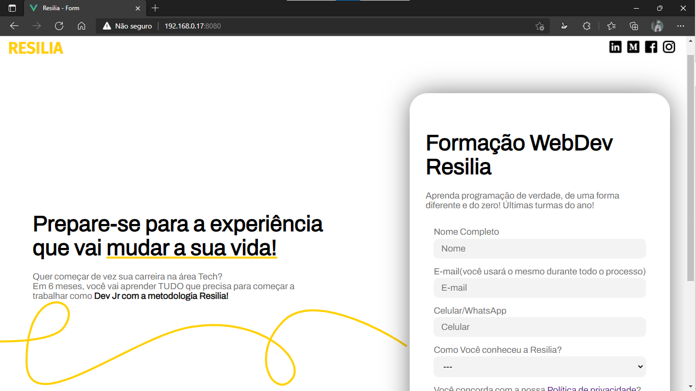
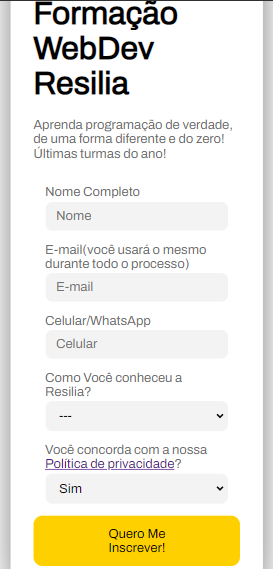

# Resilia-Form🚀

Este é a recriação de um antigo projeto que fiz com HTML e CSS.
Mas desta vez utilizei VueJS 3 para refazer o formulário e fiz um design responsivo para todos os tamanhos de tela.

## Caso você queira analisar o projeto em sua maquina, siga esses passo a passo 😁

<br>

### Clone o repositório😎

```
git clone https://github.com/jovimoura/resiliaForm
```

### Acesse o diretorio🤓

```
cd formulario
```
### Instale as dependências🤠
```
npm install
```
### Inicie a aplicação🤩
```
npm run serve
```

### O site fica na porta:🤗

```
http://localhost:8080/
```

## Imagens do projeto 💻



### Imagem responsiva 📱



## Tecnologias utilizadas🦉

<ul>
    <li>VueJS 3</li>
    <li>JavaScript</li>
    <li>HTML</li>
    <li>CSS</li>
</ul>

## Autor😃

### João Victor dos Santos Moura
### E-mail: joaovictors.mouraa@gmail.com
### Linkedin: https://www.linkedin.com/in/jovimoura10/